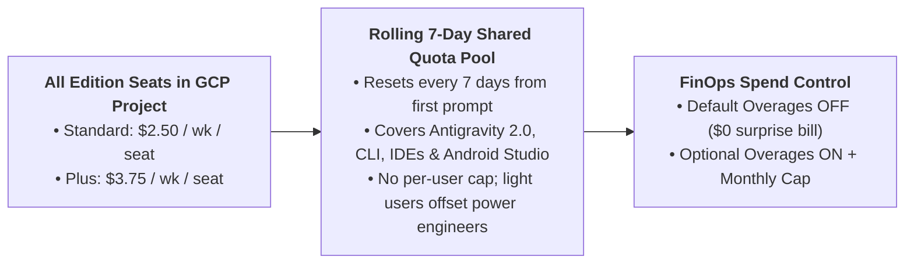

# Google Antigravity & Gemini Enterprise: Multi-Agent Engineering & Adoption Kit

This repository is a complete, ready-to-deploy **Enterprise Enablement & Reference Implementation Kit** for organizations adopting **Google Antigravity** and **Gemini Enterprise**. It provides a practical blueprint to:
1. **Empower Every Employee to Build & Orchestrate Agents**: Scale from simple no-code Markdown agents for business & operations teams to autonomous multi-agent fleets and 24x7 background sidecars for principal engineers.
2. **Integrate Seamlessly with Gemini Enterprise**: Maximize shared weekly pooled quota across **Gemini Enterprise Standard & Plus** seats, enforce centralized Google Cloud IAM and Admin Console guardrails, and route workloads across the **Gemini 3.x** and **Gemma 4** model families.
3. **Standardize Enterprise Code Quality & Security**: Combine hierarchical `AGENTS.md` / `GEMINI.md` context files, 4-trigger `_agents/rules/*.md`, progressive-disclosure `SKILL.md` bundles, and deterministic `_agents/hooks.json` lifecycle gates (`PreToolUse`, `PostToolUse`, `PreInvocation`, `PostInvocation`, `Stop`).

---

## Repository Architecture & Real-World Constructs

| Construct / Directory | Purpose & Precedence | Key Files |
| :--- | :--- | :--- |
| **Root Hierarchical Context** | Automatic directory-walk instructions from repo root (`git` root) down to active subdirectory (`100 KB` limit). | [`AGENTS.md`](AGENTS.md) (Workspace security boundaries & 4-part Subagent Prompt Contract)<br>[`GEMINI.md`](GEMINI.md) (Gemini 3.x routing & Vertex ADC binding) |
| **4-Trigger Guardrail Rules** | Dynamic rules injected via YAML frontmatter (`glob`, `model_decision`, `manual`, `always_on`). | [`_agents/rules/terraform_and_gcp_security.md`](_agents/rules/terraform_and_gcp_security.md)<br>[`_agents/rules/bigquery_finops.md`](_agents/rules/bigquery_finops.md) |
| **Deterministic Lifecycle Hooks** | Subprocess JSON gates (`PreToolUse`, `PostToolUse`, `PreInvocation`, `PostInvocation`, `Stop`) enforcing compliance in code. | [`_agents/hooks.json`](_agents/hooks.json)<br>[`hooks-scripts/gate.py`](hooks-scripts/gate.py) |
| **Progressive-Disclosure Skill** | 3-stage context loading (`~100 tokens` frontmatter -> `SKILL.md` -> `scripts/`, `resources/`, `references/`). | [`_agents/skills/cloud-architecture-readiness/SKILL.md`](_agents/skills/cloud-architecture-readiness/SKILL.md)<br>[`verify_release_readiness.py`](_agents/skills/cloud-architecture-readiness/scripts/verify_release_readiness.py) |
| **Enterprise JSON Inheritance** | Central skill/plugin inheritance & regex exclusions (`skills.json` & `plugins.json`). | [`_agents/skills.json`](_agents/skills.json)<br>[`_agents/plugins.json`](_agents/plugins.json) |
| **Executive Playbooks & Handbooks** | Governance, pooled weekly quota math, 14 slash commands, Antigravity 2.0 subagents, and enterprise value proposition playbooks. | [`docs/01_enterprise_governance_and_rollout.md`](docs/01_enterprise_governance_and_rollout.md)<br>[`docs/02_slash_commands_subagents_and_constructs_handbook.md`](docs/02_slash_commands_subagents_and_constructs_handbook.md)<br>[`docs/03_antigravity_gemini_enterprise_value_proposition.md`](docs/03_antigravity_gemini_enterprise_value_proposition.md) |
| **Tier 1: Citizen Builders (No-Code)** | Forkable Markdown Agents for PMO, Operations, Finance, Procurement, and Talent teams. | [`ops-handover-copilot.md`](starter-kits/tier1-citizen-markdown/agents/ops-handover-copilot.md)<br>[`contract-and-sla-risk-critic.md`](starter-kits/tier1-citizen-markdown/agents/contract-and-sla-risk-critic.md)<br>[`talent-skill-matcher.md`](starter-kits/tier1-citizen-markdown/agents/talent-skill-matcher.md) |
| **Tier 2: Functional & QA Analysts (Low-Code)** | Distributable Enterprise Plugin (`plugin.json`, `mcp_config.json`, `SKILL.md`, `agent.json`). | [`plugin.json`](starter-kits/tier2-enterprise-plugin/plugin.json)<br>[`solution-architect-copilot/agent.json`](starter-kits/tier2-enterprise-plugin/agents/solution-architect-copilot/agent.json) |
| **Tier 3: Delivery & Platform Engineers (Pro-Code)** | `.agents/agents/*.md` subagents + `google-antigravity` & `google-genai` SDK pipeline. | [`code-reviewer.md`](starter-kits/tier3-pro-code-and-sdk/.agents/agents/code-reviewer.md)<br>[`enterprise_modernization_agents.py`](starter-kits/tier3-pro-code-and-sdk/enterprise_modernization_agents.py) |
| **Tier 4: Principal Architects (Power-Code)** | Nested Subagent Fleet, Remote Sandbox, Deep Research, and 24x7 Sidecar Daemon. | [`nested_subagent_fleet.py`](starter-kits/tier4-architect-fleet-and-sidecar/nested_subagent_fleet.py)<br>[`remote_sandbox_and_deep_research.py`](starter-kits/tier4-architect-fleet-and-sidecar/remote_sandbox_and_deep_research.py)<br>[`sentinel_sidecar.py`](starter-kits/tier4-architect-fleet-and-sidecar/sidecars/incident-sla-sentinel/sentinel_sidecar.py) |
| **Telemetry & Quota Calculator** | Validates all agents/skills/hooks and models weekly pooled Gemini Enterprise quota for any seat count. | [`scripts/enterprise_license_and_agent_audit.py`](scripts/enterprise_license_and_agent_audit.py) |

---

## How Gemini Enterprise Pooled Quota Powers Google Antigravity

Per the official [Gemini Enterprise Quotas and Overages](https://docs.cloud.google.com/gemini/enterprise/docs/quotas-and-overages) and [AI Developer Tools Overview](https://docs.cloud.google.com/gemini/enterprise/docs/ai-developer-tools-overview) documentation, **Gemini Enterprise Standard** (`$10/user/mo` credit) and **Gemini Enterprise Plus** (`$15/user/mo` credit) pool AI developer tool quota across all users in the same edition within a Google Cloud project and location (`Global`, `US`, or `EU`) on a **rolling 7-day cycle**:

$$\text{Weekly Shared Project Pool} = \left(\frac{\text{Monthly Per-User Credit}}{4}\right) \times N_{\text{Licensed Seats}}$$



See [**Section 2.1 of `docs/03_antigravity_gemini_enterprise_value_proposition.md`**](docs/03_antigravity_gemini_enterprise_value_proposition.md#21-visual-architecture-how-gemini-enterprise-pooled-quota-works-in-google-antigravity) and [**Section 3.1 of `docs/01_enterprise_governance_and_rollout.md`**](docs/01_enterprise_governance_and_rollout.md#31-weekly-pooled-quota-formula--visual-architecture) for the full multi-persona diagram, official quota scope table, and IAM custom role reservation strategy.

---

## Quick Verification Commands

Run the deterministic validation suite to verify all Python scripts, lifecycle hooks, skill bundles, and pooled quota modeling:

```bash
# 1. Validate the entire repository kit & model weekly pooled quota (customizable via --seats)
python3 scripts/enterprise_license_and_agent_audit.py --validate-kit

# 2. Test the deterministic PreToolUse security hook (blocks 'terraform destroy')
echo '{"toolCall":{"name":"run_command","args":{"CommandLine":"terraform destroy -auto-approve"}}}' | python3 hooks-scripts/gate.py --mode=pre-tool

# 3. Run the Cloud Architecture & Release Readiness skill verifier self-test
python3 _agents/skills/cloud-architecture-readiness/scripts/verify_release_readiness.py --self-test
```
