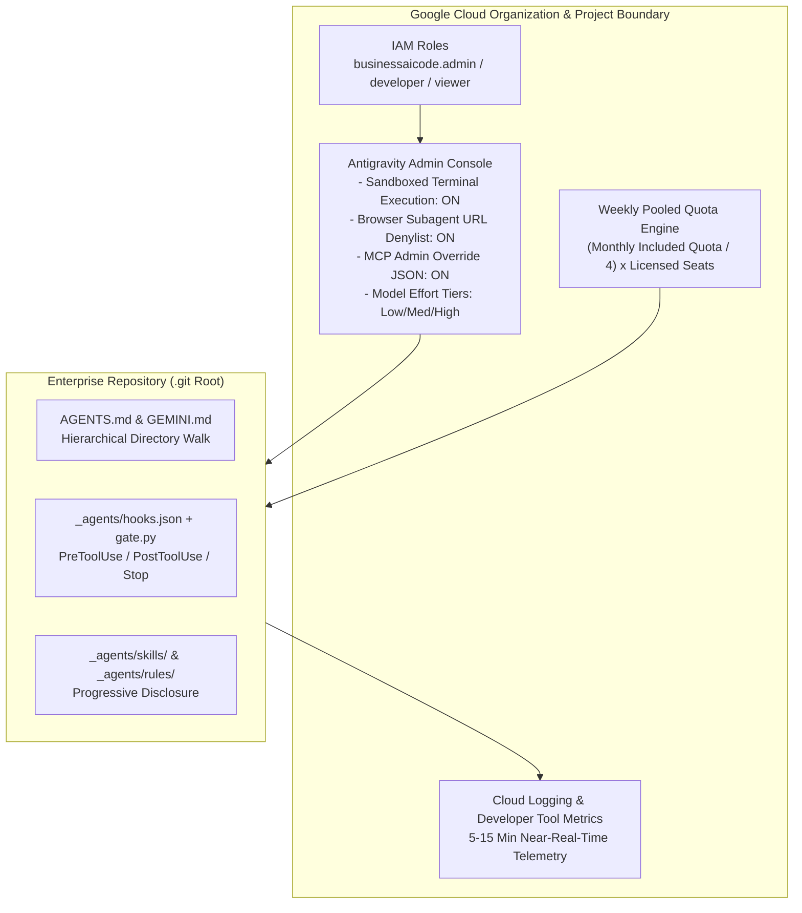
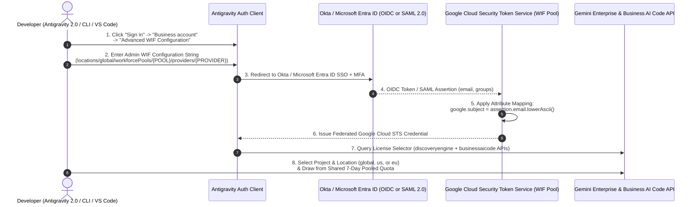
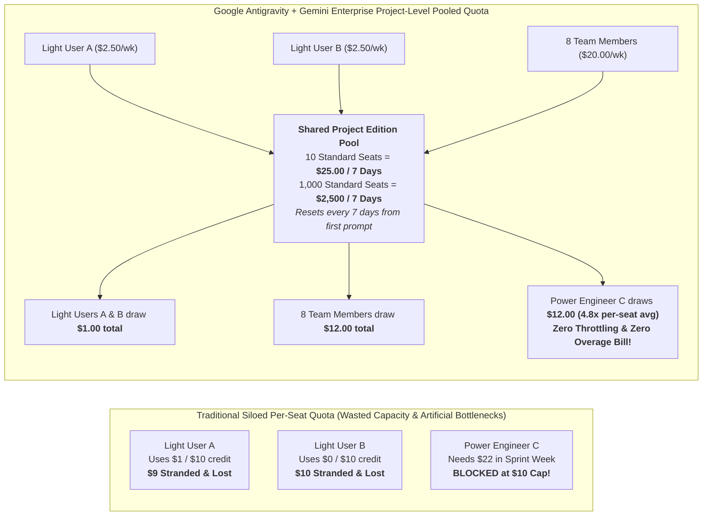

# Enterprise Governance, Gemini Enterprise Quota Economics & Rollout Playbook

## 1. Executive Objective: Multi-Agent Creation per Employee & Seamless Gemini Enterprise Integration

Modern enterprises span a wide spectrum of technical fluency—from non-technical operations, finance, procurement, and PMO staff to product analysts, full-stack developers, and principal systems architects.

To drive organization-wide adoption of **Google Antigravity** alongside active utilization of **Gemini Enterprise licenses**, this blueprint establishes a **Multi-Agent-Per-Employee Operating Model** where every employee builds and operates a personal portfolio of specialized agents:

| Agent Archetype | Purpose | Primary Gemini 3.x Model |
| :--- | :--- | :--- |
| **Agent #1: Personal Role Copilot** | Automates daily individual cognitive toil (operational handovers, backlog hygiene, PR pre-flight checks, requirement extraction). | `gemini-3.8-flash` (`Low` / `Medium` thinking) |
| **Agent #2: Domain / Project Specialist** | Grounded in a team's repository or business domain (`AGENTS.md` + `_agents/rules/*.md`), enforcing architecture standards, FinOps rules, and runbooks. | `gemini-3.8-flash` / `gemini-3.1-pro-preview` |
| **Agent #3: Automated Quality, Security or Ops Critic** | Runs via custom subagent (`.agents/agents/*.md`), recurring `/schedule` cron, or background `sidecar.json` to audit code quality, security SLAs, or contractual risk. | `gemini-3.7-flash` / `gemini-3.5-flash-lite` |

---

## 2. Gemini Enterprise + Antigravity Admin Governance Architecture

Unlike unmanaged consumer coding tools, Google Antigravity is governed centrally via the **Google Cloud Console (Gemini Enterprise -> Antigravity Admin Controls)**:



### 2.1 Granular IAM Role Separation

| IAM Role | Principal Group | Scope & Capabilities |
| :--- | :--- | :--- |
| `roles/businessaicode.admin` | Platform Engineering & Security Architects | Configure terminal OS sandboxing, browser URL allow/denylists, approved MCP servers, model effort levels (`Low`/`Medium`/`High`), and compliance logging. |
| `roles/businessaicode.developer` | Licensed Employees Across All Tiers | Authenticate IDE/CLI via Google Cloud Project ID, invoke Gemini 3.x models, spawn subagents, and consume pooled project quota. |
| `roles/businessaicode.viewer` | Engineering Leadership & FinOps Teams | View **Developer Tool Metrics** (active seats, requests, tokens, error rates, latency) refreshed every **5–15 minutes**. |

### 2.2 Five Mandatory Enterprise Security Controls (ISO27001 / SOC2 / HIPAA / PCI Readiness)

1. **Terminal OS Sandbox Enforcement**:
   - Enable `Execute terminal commands in sandbox` in the Admin Console.
   - Restricts file system writes outside the workspace root and blocks unauthorized outbound network sockets unless explicitly approved.
2. **Browser Subagent Governance**:
   - Set `Open URLs` to **Controlled by blocklist/allowlist**.
   - Block public paste sites (`pastebin.com`, `gist.github.com`), personal webmail, and unapproved file-sharing domains while allowing internal documentation, issue trackers, and staging environments.
3. **Centralized MCP Registry Override**:
   - Toggle `Provide a custom JSON configuration` to **ON** in the Admin Console.
   - Injects a read-only, security-vetted MCP server registry onto every developer machine, preventing shadow MCP servers from exfiltrating sensitive data.
4. **Compliance Audit Logging (`Include prompts and responses in logs`)**:
   - Enabled selectively for regulated projects so every prompt, tool call, and response is immutably written to Cloud Logging and exported to BigQuery for compliance audits.
5. **Deterministic Local Hook Gates ([`_agents/hooks.json`](../_agents/hooks.json))**:
   - Even if a developer runs in `Turbo` permission mode, `PreToolUse` hooks in [`hooks-scripts/gate.py`](../hooks-scripts/gate.py) deterministically deny destructive commands (`terraform destroy`, `rm -rf`, `DROP TABLE`) and block credential file edits before execution.

### 2.3 Third-Party Identity Provider (IdP) Authentication: Okta, Microsoft Entra ID & OIDC/SAML (`BYOID / WIF`)

Enterprise customers using **Okta**, **Microsoft Entra ID (formerly Azure AD)**, **Ping Identity**, or **AD FS** can authenticate developers into **Google Antigravity 2.0**, **Antigravity CLI**, and **Antigravity IDE Extensions** without requiring consumer Google accounts. Per [Antigravity Enterprise — Bring Your Own Identity (`BYOID / WIF`)](https://antigravity.google/docs/enterprise#bring-your-own-identity-byoid--wif) and [Configure Identity Provider in Gemini Enterprise](https://docs.cloud.google.com/gemini/enterprise/docs/configure-identity-provider), two enterprise federation patterns are supported:

| Federation Pattern | How It Works | Supported Surfaces & Key Considerations |
| :--- | :--- | :--- |
| **Pattern A: Direct Workforce Identity Federation (`BYOID / WIF`)** | Connects **Okta** or **Microsoft Entra ID** (OIDC or SAML 2.0) directly to a Google Cloud **Workforce Identity Pool** (`iam.googleapis.com/locations/global/workforcePools/{POOL_ID}`) bound to Gemini Enterprise (`3rd party identity`). | • **Supported**: **Antigravity 2.0**, **Antigravity CLI**, **Antigravity for IDEs** (VS Code, JetBrains, Visual Studio, Zed, Xcode), and **Application Default Credentials (ADC)**.<br>• **Limitation**: Per [AI developer tools known limitations](https://docs.cloud.google.com/gemini/enterprise/docs/ai-developer-tools-overview#known-limitations), **Android Studio** does not support third-party identity providers in locations configured with `3rd party identity`.<br>• **Required for M365 Ingestion**: Mandatory if Gemini Enterprise also ingests SharePoint, OneDrive, or Outlook data. |
| **Pattern B: Google Cloud Identity Federated with Okta / Entra ID** | Synchronizes Okta or Microsoft Entra ID users/groups into **Google Cloud Identity** (via GCDS / SCIM) with Okta/Entra configured as the upstream SAML/OIDC SSO provider, while selecting **Google Identity** in Gemini Enterprise. | • **Supported**: **100% of surfaces** including **Antigravity 2.0**, **Antigravity CLI**, **Antigravity for IDEs**, **Android Studio**, and Google Workspace connectors.<br>• Users click **Continue with Google Cloud** and are redirected automatically to Okta or Microsoft Entra ID SSO. |



#### Step-by-Step Admin & Developer Runbook for Okta and Microsoft Entra ID (`BYOID / WIF`)

1. **Step 1 — Enable Required APIs in the Target Google Cloud Project**:
   - Before purchasing or assigning licenses, enable the three required APIs and wait **~5 minutes** for propagation:
     ```bash
     gcloud services enable \
       aiplatform.googleapis.com \
       discoveryengine.googleapis.com \
       businessaicode.googleapis.com \
       --project="${GCP_PROJECT_ID}"
     ```
2. **Step 2 — Create the Workforce Identity Pool & Provider (Okta or Microsoft Entra ID)**:
   - In Google Cloud Console, navigate to **IAM & Admin > Workforce Identity Pools** (`https://console.cloud.google.com/iam-admin/workforce-identity-pools`) at the Organization level and create a pool (`corp-workforce-pool`) and OIDC/SAML provider.
   - **CRITICAL Attribute Mapping Rule (Case-Sensitive License Matching)**: Per [Configure attribute mapping](https://docs.cloud.google.com/gemini/enterprise/docs/configure-identity-provider#attribute_mapping), `google.subject` is used for license assignment and **must use `.lowerAscii()`** so uppercase characters in corporate emails never break license matching:

   | Identity Provider & Protocol | Exact Required Workforce Identity Federation Attribute Mapping |
   | :--- | :--- |
   | **Microsoft Entra ID (OIDC)** | `google.subject=assertion.email.lowerAscii()`<br>`google.groups=assertion.groups`<br>`google.display_name=assertion.given_name`<br>`attribute.as_user_identifier_1=assertion.preferred_username` |
   | **Microsoft Entra ID (SAML 2.0)** | `google.subject=assertion.attributes['http://schemas.xmlsoap.org/ws/2005/05/identity/claims/emailaddress'][0].lowerAscii()`<br>`google.groups=assertion.attributes['http://schemas.microsoft.com/ws/2008/06/identity/claims/groups']`<br>`google.display_name=assertion.attributes['http://schemas.xmlsoap.org/ws/2005/05/identity/claims/givenname'][0]` |
   | **Okta (OIDC)** | `google.subject=assertion.email.lowerAscii()`<br>`google.groups=assertion.groups` |
   | **Okta (SAML 2.0)** | `google.subject=assertion.subject.lowerAscii()`<br>`google.groups=assertion.attributes['groups']` |

   - *(Recommended)* Enable **SCIM provisioning** ([Configure SCIM in Microsoft Entra ID](https://docs.cloud.google.com/iam/docs/configure-scim-ms-entra) or [Configure SCIM in Okta](https://docs.cloud.google.com/iam/docs/configure-scim-okta)) to synchronize large group memberships and enable user/group autocomplete.
3. **Step 3 — Bind the 3rd-Party IdP to Gemini Enterprise & Grant IAM Roles**:
   - Go to **Gemini Enterprise > Settings > Authentication** (`https://console.cloud.google.com/gemini-enterprise/apps`).
   - Click **Add identity provider** for your target location (`global`, `us`, or `eu`) $\rightarrow$ select **3rd party identity** $\rightarrow$ select your **Workforce Identity Pool** $\rightarrow$ click **Save changes**.
   - Grant the **`Gemini Enterprise User`** role (`roles/discoveryengine.agentspaceUser`) to your federated Okta/Entra group or users:
     ```bash
     # Grant access to an entire Okta or Microsoft Entra ID group:
     gcloud projects add-iam-policy-binding "${GCP_PROJECT_ID}" \
       --member="principalSet://iam.googleapis.com/locations/global/workforcePools/${POOL_ID}/group/${OKTA_OR_ENTRA_GROUP_ID}" \
       --role="roles/discoveryengine.agentspaceUser"
     ```
4. **Step 4 — Developer Sign-In in Antigravity (`Interactive BYOID` & `Headless ADC`)**:
   - **Interactive Sign-In (`Antigravity 2.0`, `Antigravity CLI`, `VS Code / JetBrains`)**:
     1. Open Antigravity and click **Sign in** $\rightarrow$ select **Business account**.
     2. Click **Advanced WIF Configuration**.
     3. Enter the **WIF Configuration String** provided by your administrator (`locations/global/workforcePools/{POOL_ID}/providers/{PROVIDER_ID}`).
     4. Authenticate through **Okta** or **Microsoft Entra ID** in the browser window.
     5. In the **License Selector**, pick your assigned Google Cloud project (or select **Other** to self-assign a license by entering `PROJECT_ID` and location `global`, `us`, or `eu`).
   - **Headless / Terminal ADC Sign-In with Okta or Entra ID (`AGY_ADC_AUTH=true`)**:
     ```bash
     # 1. Generate the WIF login configuration file once:
     gcloud iam workforce-pools create-login-config \
       "locations/global/workforcePools/${POOL_ID}/providers/${PROVIDER_ID}" \
       --output-file="$HOME/.config/gcloud/wif-login-config.json"

     # 2. Authenticate ADC via browser SSO (Okta / Entra ID) and bind the quota project:
     gcloud auth application-default login \
       --login-config="$HOME/.config/gcloud/wif-login-config.json" \
       --project="${GCP_PROJECT_ID}"

     # 3. Enable ADC in Antigravity CLI (or set "userSettings": {"enableAdc": true} in ~/.gemini/config/config.json):
     export AGY_ADC_AUTH=true
     export GOOGLE_CLOUD_QUOTA_PROJECT="${GCP_PROJECT_ID}"
     export GOOGLE_CLOUD_LOCATION="global"
     ```
5. **Step 5 — Verify Federated Attribute Mapping in Cloud Audit Logs**:
   - In **IAM & Admin > Audit Logs** (`https://console.cloud.google.com/iam-admin/audit`), enable **Admin Read** Data Access logs for the **Security Token Service API**, and toggle **Enable detailed audit logging** to **ON** in your Workforce Identity Pool.
   - Filter Cloud Logging for `protoPayload.methodName="google.identity.sts.SecurityTokenService.WebSignIn"` and verify that `metadata.mapped_attributes.google.subject` matches the user's lowercase email address.

---

## 3. FinOps & Weekly Pooled Quota Engineering (Gemini Enterprise Integration)

Understanding how Gemini Enterprise funds Antigravity usage allows organizations to scale agent adoption across thousands of employees without surprise token overages.

### 3.1 Weekly Pooled Quota Formula & Visual Architecture

Per the official [Gemini Enterprise Quotas and Overages](https://docs.cloud.google.com/gemini/enterprise/docs/quotas-and-overages), [AI Developer Tools Overview](https://docs.cloud.google.com/gemini/enterprise/docs/ai-developer-tools-overview), and [View Pooled Quota Usage](https://docs.cloud.google.com/gemini/enterprise/docs/feature-usage) documentation, AI developer tools credits (**Google Antigravity 2.0**, **Antigravity CLI**, **Antigravity for IDEs**, and **Android Studio**) are pooled across all users in the **same edition** within a **Google Cloud project and location** (`Global`, `US`, or `EU`) on a **rolling seven-day basis**:

$$\text{Weekly Project Quota Pool} = \left(\frac{\text{Monthly Included Credit per Seat}}{4}\right) \times N_{\text{Licensed Seats (including Free-Trial Seats)}}$$

| License Edition | License Price | Included AI Developer Tools Credit / Seat | Rolling 7-Day Pool Contribution / Seat | **Weekly Project Pool Formula ($N$ Seats)** | **Example: 100 Seats** | **Example: 1,000 Seats** |
| :--- | :--- | :--- | :--- | :--- | :--- | :--- |
| **Gemini Enterprise Standard** | $30 / user / mo | $10.00 / user / mo | $2.50 / user / 7 days | **$\$2.50 \times N$ / 7 days** | **$250 / week** | **$2,500 / week** ($10,000 / mo) |
| **Gemini Enterprise Plus** | $45+ / user / mo | $15.00 / user / mo | $3.75 / user / 7 days | **$\$3.75 \times N$ / 7 days** | **$375 / week** | **$3,750 / week** ($15,000 / mo) |
| **Gemini Enterprise Pay-as-you-go** | $0 seat fee *(Invoiced Billing)* | Unpooled (Pay for actual usage) | Unpooled | Billed at [Agent Platform API prices](https://cloud.google.com/gemini-enterprise-agent-platform/generative-ai/pricing#cost-of-building-and-deploying-ai-models-in-agent-platform) | Pure consumption | Pure consumption |



> [!IMPORTANT]
> **Five Grounded Rules from Official Google Cloud Documentation**:
> 1. **Per-Edition, Per-Project, Per-Location Pooling**: Feature quotas (including **AI developer tools**, **Assistant** at `160–200 queries/day`, **Deep Research** at `3–10/day`, and **No-code agent creation** at `1–10/day`) are pooled across all users holding the **same edition** within a Google Cloud project and location. (**Storage + data indexing** at `30 GiB` Standard / `75 GiB` Plus is pooled across *all* editions combined in that project and location.)
> 2. **Rolling 7-Day Reset Clock (Anchored to First Prompt)**: Unlike Assistant/Search quotas (which reset daily at midnight PT), the **AI developer tools quota resets every seven days starting from when a prompt or request is first sent to an AI developer tool** in the project. For example, if the first Antigravity prompt is sent on **Wednesday at 2:00 PM PT**, the 7-day cycle runs until the **following Wednesday at 2:00 PM PT**. Unused weekly quota does not roll over.
> 3. **Automatic License Scaling (Zero Quota-Increase Tickets)**: Unlike standard Google Cloud infrastructure quotas, Gemini Enterprise feature quotas automatically scale up or down as you assign or add licenses (including free-trial seats) in your subscription.
> 4. **IAM Custom Role Strategy to Dedicate Pool Capacity to Engineers**: Per [AI Developer Tools Required Roles](https://docs.cloud.google.com/gemini/enterprise/docs/ai-developer-tools-overview#before-you-begin), users require `roles/discoveryengine.agentspaceUser` (`Gemini Enterprise User`) to access Antigravity, while `roles/discoveryengine.agentspaceAdmin` (`Gemini Enterprise Admin`) is required to configure settings and view **Gemini Enterprise > Usage & Spending** metrics (`monitoring.timeSeries.list` and `serviceconsumermanagement.quota.get`). Administrators can assign a **custom IAM role** that omits AI developer tools permissions to non-engineering seats in the same project—allowing those seats to use Assistant/Search while **contributing 100% of their weekly AI developer tool credits to the software engineering pool**.
> 5. **Hard Stop (`Overages: OFF`) vs. Controlled Burst (`Overages: ON`)**: By default, usage stops when the 7-day shared pool reaches 100% (zero surprise cloud billing). On invoiced Cloud Billing accounts with paid subscriptions, administrators can enable **Overages** and set a **Monthly Spending Limit** to allow seamless continuation at Agent Platform API rates.

### 3.2 Workload-to-Model Effort Routing Matrix

To maximize the weekly project quota pool across all active agents, enforce the following routing policy (configured in [`GEMINI.md`](../GEMINI.md)):

| Workload Share | Task Category | Target Model | Thinking / Effort Level | Relative Quota Impact |
| :--- | :--- | :--- | :--- | :--- |
| **80% of Calls** | Subagent repo exploration, unit test generation, PR review, operational digests, SQL linting | `gemini-3.8-flash` / `gemini-3.7-flash` | `Low` or `Medium` | **1x (Baseline)** |
| **10% of Calls** | High-frequency log classification, commit message drafting, PII tagging | `gemini-3.5-flash-lite` | `Minimal` | **0.25x (Ultra-Low)** |
| **10% of Calls** | Complex legacy refactoring, distributed systems architecture, `/goal` autonomous loops | `gemini-3.1-pro-preview` / `antigravity-preview-05-2026` | `High` (or `/boost` when urgent) | **5x–8x (Reserved for High-Complexity)** |
| **Local Zero-Egress** | Strict zero-egress data scrubbing & local AST pre-filtering | `gemma-4-26b-a4b-it` (`LiteRTAgentConfig`) | Local NPU / GPU | **$0.00 Cloud Quota** |

### 3.3 Where to View Tokenomics & Pooled Quota Usage (User, Project & Org Levels) + Threshold Alerts

Grounded in [View Pooled Quota Usage](https://docs.cloud.google.com/gemini/enterprise/docs/feature-usage), [View AI Developer Tools Metrics](https://docs.cloud.google.com/gemini/enterprise/docs/ai-developer-tools-metrics), [View Costs](https://docs.cloud.google.com/gemini/enterprise/docs/view-costs), [Configure Overages and Spend Limits](https://docs.cloud.google.com/gemini/enterprise/docs/configure-overages), and [Antigravity CLI `/usage` & `/credits`](https://antigravity.google/docs/cli/commands/usage/), the table below specifies exactly where engineers, project admins, and FinOps teams inspect tokenomics and pooled quota consumption across all three levels:

| Visibility Level | Exact Surface / Console Path / Command | Required IAM Role / Permission | Metrics Displayed & Refresh Cadence |
| :--- | :--- | :--- | :--- |
| **1. User Level**<br>*(Developer IDE & CLI)* | • **Model Quotas Panel**: Type **`/usage`** (or alias **`/quota`**) in Antigravity CLI / 2.0.<br>• **Credits Panel & Statusline**: Type **`/credits`** (or inspect the bottom-right CLI statusline `AI Credits: <N>`).<br>• **Per-User Log Attribution**: Enable **Metadata logging** (or **Prompts and responses logging**) in **Gemini Enterprise > Settings > AI developer tools** and query Cloud Logging by `principalEmail` / `google.subject`. | • `roles/discoveryengine.agentspaceUser` (for IDE/CLI `/usage` and `/credits`)<br>• `roles/logging.viewer` (for Cloud Logging per-user queries) | • **Live on-demand refresh** when `/usage` is opened: per-model remaining requests/tokens (`Gemini 3.8 Flash`, `Gemini 3.1 Pro`).<br>• Current billing cycle credit summary and automatic statusline highlight when approaching low-quota threshold.<br>• Note: Set `"useG1Credits": false` in `/config` (`settings.json`) so enterprise users never fall back to personal credits. |
| **2A. Project Level — Pooled Quota %**<br>*(Usage & Spending)* | **Google Cloud Console**:<br>**Gemini Enterprise > Usage & Spending > Usage tab**<br>(`https://console.cloud.google.com/gemini-enterprise/usage-and-spending`)<br>1. Select license **Location** (`global`, `us`, `eu`).<br>2. Under **Usage details**, select **Subscription tier** (`Standard`, `Plus`, `Pay-as-you-go`). | `roles/discoveryengine.agentspaceAdmin`<br>*(Requires `monitoring.timeSeries.list`—without it usage shows `0`—and `serviceconsumermanagement.quota.get`—without it limit shows `Unknown`)* | • **Absolute dollar/query usage and percentage (%) consumed** of every pooled quota in the project:<br>  - Rolling 7-day **AI developer tools** credit pool (`$2.50 × seats` Standard / `$3.75 × seats` Plus)<br>  - Daily **Assistant** (`160–200/day × seats`) & **Deep Research** (`3–10/day × seats`) pools<br>  - Cross-edition **Storage + data indexing** pool |
| **2B. Project Level — Tokenomics & Adoption**<br>*(Developer Tools Metrics)* | **Google Cloud Console**:<br>**Gemini Enterprise > Developer tools metrics**<br>(`https://console.cloud.google.com/gemini-enterprise`)<br>• Use the top-right **Time-range selector** (`15m`, `1h`, `1d`, `7d`, `14d`, or custom start/end) with **Auto-refresh** enabled. | `roles/discoveryengine.agentspaceAdmin` | • **Refreshes within 5–15 minutes of user activity**.<br>• **Active Users (Adoption)**: Hourly, Daily, Weekly, and Monthly (28-day) unique active users (averages + trend line charts).<br>• **Tools & API Calls (Tokenomics)**:<br>  - **Total Tokens**: Combined input + output tokens consumed across Antigravity surfaces.<br>  - **Daily Token Usage**: Daily token burn trend line.<br>  - **Daily API Calls**: Daily calls broken down by `error_type` (quota limits, auth errors, client errors).<br>• Click **More chart options (`⋮`) > Inspect related logs** to open a split-view of correlated Cloud Logging entries (`±5 min` window). |
| **2C. Project Level — Overage & API Spend**<br>*(Billing Tab)* | **Google Cloud Console**:<br>**Gemini Enterprise > Usage & Spending > Billing tab**<br>(`https://console.cloud.google.com/gemini-enterprise/usage-and-spending`) | `roles/discoveryengine.agentspaceAdmin` (on project) **AND** `roles/billing.viewer` or `roles/billing.admin` (on Billing Account) | • **Gemini Enterprise costs (Last 30 days)** broken down by:<br>  1. `Gemini Enterprise app`<br>  2. `Gemini Enterprise Agent Platform`<br>  3. `AI developer tools (such as Antigravity)`<br>  4. `Total cost` + 30-day trend chart *(Note: includes background `Gemini Flash Lite` and `Gemini 3 Pro Image` calls)*. |
| **3. Organization Level**<br>*(Cross-Project FinOps & Multi-BU Rollup)* | • **Cloud Billing Reports & BigQuery Billing Export**: In the **Billing tab**, click **View details in Billing** (`https://console.cloud.google.com/billing`) and group by **Project / Folder / Label**.<br>• **Multi-Project Cloud Monitoring Scope**: Add all Gemini Enterprise projects into a central **Cloud Monitoring Metrics Scope** (`Metrics Explorer`). | • `roles/billing.viewer` or `roles/billing.admin` (on Organization Billing Account)<br>• `roles/monitoring.viewer` (on scoping project) | • Organization-wide view of subscription fees, pooled quota utilization, and overage charges across all business units.<br>• Note: In Cloud Billing, Gemini Enterprise and Antigravity overage charges are billed under the **Vertex AI (`aiplatform.googleapis.com`)** service. |

#### Configuring Threshold Alerts & Automated Spend Caps (3-Layer Alerting Setup)

To ensure engineering leaders and FinOps teams are notified before a project's rolling 7-day pool or monthly overage budget is exhausted, configure these three native alerting layers:

1. **Layer 1: Cloud Monitoring Metric Threshold Alerts (Directly from `Developer tools metrics`)**:
   - **How to Configure**:
     1. Open **Gemini Enterprise > Developer tools metrics** in the Google Cloud Console.
     2. On any line chart (**Daily Token Usage**, **Daily API Calls**, or **Hourly Active Users**), click the **Create alert policy (`add_alert` bell icon)** in the chart toolbar.
     3. This opens the **Cloud Monitoring Alerting Workflow** pre-populated with the chart's underlying time-series query (or click **Explore data** to open **Metrics Explorer** and group/filter by `error_type="quota_exceeded"` or `serviceconsumermanagement.googleapis.com/quota`).
     4. Set your threshold triggers:
        - **Warning Alert (`75%` of Weekly Pool / Token Run-Rate)**: Notify Engineering Managers & FinOps Slack/Google Chat channel to ensure 80% of subagent traffic is routed to `gemini-3.8-flash` (`Low`/`Medium`).
        - **Critical Alert (`90%` of Weekly Pool / Quota Error Spike)**: Notify Platform Admin via PagerDuty/Email/Pub/Sub to decide whether to enable temporary burst overages for critical release sprints.
2. **Layer 2: Project Monthly Spend Limit & Cloud Billing Budget Alerts (`50% / 80% / 90% / 100%`)**:
   - **How to Configure** (per [Set a monthly spend limit](https://docs.cloud.google.com/gemini/enterprise/docs/configure-overages#set-spend-limit)):
     1. Go to **Gemini Enterprise > Usage & Spending > Usage tab**.
     2. In the **Project monthly spend limit** section, click **Set limit**.
     3. In Cloud Billing, scope the budget to **Service: `Vertex AI (aiplatform.googleapis.com)`** (all Antigravity and Gemini Enterprise overages bill under `aiplatform.googleapis.com`).
     4. Configure alert thresholds at **50%, 80%, 90%, and 100%** of the monthly dollar cap.
     5. **Automatic Hard Stop**: When the project reaches **100%** of the configured monthly spend limit, **Gemini Enterprise automatically stops overage usage** within a few minutes so costs cannot run away.
3. **Layer 3: Developer Workstation Low-Quota Statusline Alert**:
   - Inside the **Antigravity CLI** and **Antigravity 2.0**, the right-hand statusline indicator automatically highlights a **Low Quota Alert** when remaining credits drop below the warning threshold, prompting developers to run `/usage` or switch routine tasks from `gemini-3.1-pro-preview` to `gemini-3.8-flash` or local `Gemma 4`.

---

## 4. 4-Tier Workforce Enablement Model (From Business Users to Principal Architects)

| Tier | Workforce Persona | Technical Depth | Core Agents Built per Employee | Starter Kit Directory |
| :--- | :--- | :--- | :--- | :--- |
| **Tier 1: Citizen Builders** | Operations, PMO, Finance, Procurement, HR & Service Desk Teams | No-Code (Markdown & Slash Commands) | 1. **Operations Handover Copilot** (`/schedule`)<br>2. **Contract & SLA Risk Critic** (`/grill-me`)<br>3. **Talent & Project Skill Matcher** | [`starter-kits/tier1-citizen-markdown/`](../starter-kits/tier1-citizen-markdown/) |
| **Tier 2: Functional & QA Analysts** | Product Managers, Business Analysts, QA Leads, Scrum Masters, Solutions Engineers | Low-Code (JSON/YAML Plugins + `/browser`) | 1. **Solution Architect & WBS Estimator**<br>2. **Visual E2E `/browser` QA Verifier**<br>3. **Backlog & Sprint Hygiene Agent** | [`starter-kits/tier2-enterprise-plugin/`](../starter-kits/tier2-enterprise-plugin/) |
| **Tier 3: Delivery & Platform Engineers** | Full-Stack Developers, Data/BigQuery Engineers, DevOps/SRE, Cloud Engineers | Pro-Code (`.agents/agents/*.md` + Python AGY SDK) | 1. **Service Modernization Agent** (`New Worktree Mode`)<br>2. **Code Reviewer Subagent** (`code-reviewer.md`)<br>3. **Security & FinOps Auditor** (`security-and-finops-auditor.md`) | [`starter-kits/tier3-pro-code-and-sdk/`](../starter-kits/tier3-pro-code-and-sdk/) |
| **Tier 4: Principal Architects & AI CoE** | Principal Architects, Staff Engineers, Security Leads | Power-Code (Nested Fleets, Remote Sandboxes, Sidecars) | 1. **Multi-Agent Modernization Orchestrator**<br>2. **24x7 Incident & SLA Sentinel Sidecar** (`sidecar.json`)<br>3. **Deep Research Architecture & Competitive Agent** | [`starter-kits/tier4-architect-fleet-and-sidecar/`](../starter-kits/tier4-architect-fleet-and-sidecar/) |

---

## 5. Phased 90-Day Enterprise Rollout & Hands-On Enablement Roadmap

### Phase 1: Foundation, Admin Hardening & Golden Repo Seeding (Days 1–30)
- **Week 1**: Provision GCP Governance Projects by business unit or environment. Bind `roles/businessaicode.admin`, `developer`, and `viewer`.
- **Week 2**: Enable OS Sandbox, Browser URL allowlists, and Admin-overridden MCP JSON in the Antigravity Admin Console.
- **Week 3**: Commit [`AGENTS.md`](../AGENTS.md), [`GEMINI.md`](../GEMINI.md), [`_agents/hooks.json`](../_agents/hooks.json), and [`_agents/skills.json`](../_agents/skills.json) into core production Git repositories.
- **Week 4**: Certify Tier 4 Architects as **AI Champions** to lead departmental enablement pods.

### Phase 2: Hands-On "Multi-Agent Builder" Enablement Waves (Days 31–60)
Run structured 90-minute hands-on workshops across business and engineering teams:
- **Minutes 0–15**: Verify Gemini Enterprise Project ID login (`/config`, `/model`) and review `AGENTS.md` workspace boundaries.
- **Minutes 15–40 (Agent #1)**: Fork & customize a **Personal Role Copilot** from `starter-kits/tier1-citizen-markdown/` or `tier2-enterprise-plugin/`.
- **Minutes 40–65 (Agent #2)**: Build a **Domain Specialist Agent** grounded in team schemas and test it with `/grill-me` and `/plan`.
- **Minutes 65–90 (Agent #3)**: Configure an **Automated Reviewer Subagent** (`.agents/agents/*.md`) or recurring `/schedule` task, then run `/learn` to persist team lessons into `.agents/skills/`.

### Phase 3: Autonomous Operations & Legacy Tool Consolidation (Days 61–90)
- Deploy Tier 4 `sidecar.json` daemons across operations teams for automated incident triage.
- Enforce `hooks-scripts/gate.py` in CI/CD and local repositories.
- Consolidate fragmented point tools and unmanaged CLI subscriptions using side-by-side velocity and cost telemetry from **Developer Tool Metrics**.
