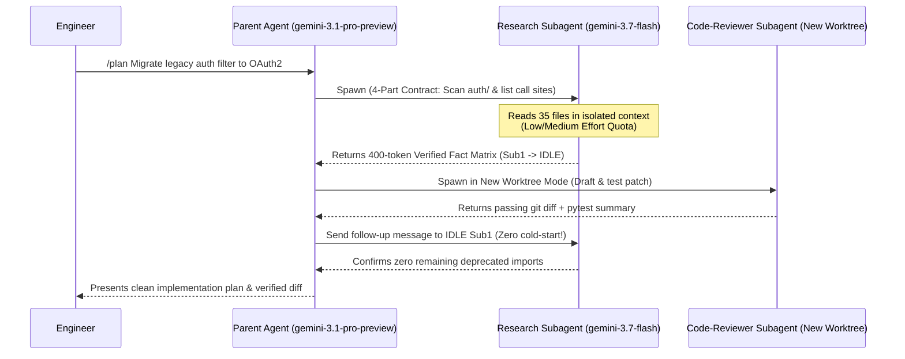

# Antigravity 2.0 Slash Commands, Subagents & Real-World Constructs Handbook

> [!NOTE]
> **Disclaimer**: This document is part of an **unofficial, personal GitHub repository** and reflects the author's personal views. For authoritative and up-to-date product specifications, commands, and SDK references, always refer to the official [Google Cloud Gemini Enterprise Documentation](https://docs.cloud.google.com/gemini/enterprise/docs/overview) and [Google Antigravity Documentation](https://antigravity.google/docs).

This handbook serves as the daily operational reference for all enterprise users—from non-technical business and operations staff to principal engineers. Every command and construct below includes **copy-pasteable enterprise examples**.

---

## 1. The 9 Workflow Slash Commands (With Copy-Paste Enterprise Examples)

### 1.1 `/grill-me` — Interactive Socratic Requirements & Edge-Case Stress-Tester
- **When to use**: Before writing an architecture RFC, product specification, contract deliverable, or microservice migration design—when requirements are ambiguous or incomplete.
- **How it works**: Reverses the standard prompt flow. The agent interviews *you* with targeted architectural, SLA, security, and edge-case questions until all ambiguities are resolved.
- **Copy-Paste Example (Systems Architect / Engineer)**:
  ```text
  /grill-me We are migrating our core payment reconciliation batch from legacy PL/SQL to Google Cloud BigQuery and Cloud Run. Interview me on RTO/RPO SLAs, PCI-DSS tokenization boundaries, idempotency on retry, and peak end-of-month volume before we draft the architecture blueprint.
  ```
- **Copy-Paste Example (Business / Operations / Procurement Lead)**:
  ```text
  /grill-me I need to draft the SLA penalty and transition deliverables section for a multi-year managed cloud services contract. Grill me on incident severity definitions, handoff timelines, acceptance criteria, and third-party vendor dependencies.
  ```

---

### 1.2 `/plan` — Structured Multi-Step Implementation Blueprint Gate
- **When to use**: Any task touching **3+ files**, database schemas, Terraform infrastructure, or cross-module refactoring.
- **How it works**: Searches the repository, identifies exact file paths and dependencies, and writes a structured `implementation_plan.md` artifact. **Zero files are modified** until the human user clicks **Proceed** or approves the plan.
- **Copy-Paste Example (Full-Stack / Platform Engineer)**:
  ```text
  /plan Refactor our customer-onboarding service in services/onboarding/ to replace hardcoded JDBC credentials with Google Cloud Secret Manager and Workload Identity Federation. List every class, Terraform IAM binding, and unit test that will change, and wait for my approval.
  ```

---

### 1.3 `/goal` — Autonomous Iterative Execution Until Verification Passes
- **When to use**: Long-running deterministic engineering goals (e.g., raising unit test coverage, fixing a batch of compiler/linter errors, or completing a framework upgrade) where a clear pass/fail command exists.
- **How it works**: The agent loops autonomously—editing code, running test suites, analyzing stack traces, and fixing regressions—until the target verification condition succeeds.
- **Copy-Paste Example (Backend / Data Engineer)**:
  ```text
  /goal Upgrade all Python services in ./etl-workers/ from Python 3.9 to Python 3.12, replace deprecated datetime.utcnow() calls with timezone-aware datetime.now(timezone.utc), and iterate until `pytest tests/ --cov=etl_workers --cov-fail-under=90` exits with code 0.
  ```

---

### 1.4 `/browser` — Live Headless/Visible Chromium E2E Verification & Scraping
- **When to use**: Validating web UI flows, checking CSS/layout regressions, capturing DOM/console errors, or auditing internal portal tables without writing brittle Selenium scripts.
- **How it works**: Launches the built-in `browser` subagent (`gemini-3.8-flash` multimodal vision + DOM inspection) subject to the Admin Console URL allowlist/denylist.
- **Copy-Paste Example (QA Automation / Frontend Engineer)**:
  ```text
  /browser Open http://localhost:3000/claims-checkout, log in with the staging test fixture user, submit a multi-currency claim for EUR 12,450, verify the confirmation toast appears without any browser console errors, and save a screenshot artifact for our release sign-off.
  ```

---

### 1.5 `/learn` — Self-Improving Team Memory (Auto-Generates `.agents/skills/`)
- **When to use**: Immediately after resolving a tricky bug, undocumented database quirk, or recurring PR review correction.
- **How it works**: Extracts the reusable root cause, verification steps, and code pattern from the current conversation and packages them into a permanent, version-controlled `SKILL.md` inside `.agents/skills/`.
- **Copy-Paste Example (Tech Lead)**:
  ```text
  /learn Package our resolution for the UTF-16 byte-order-mark parsing failure in Dataflow into a reusable team skill under _agents/skills/utf16-bom-encoding-fix/SKILL.md so no engineer on our team hits this bug again.
  ```

---

### 1.6 `/schedule` — Recurring Cron & Operational Handover Automation
- **When to use**: Automating daily operational handovers, morning blocker checks, or nightly dependency drift audits.
- **How it works**: Registers a one-shot timer or recurring 5-field cron schedule (`30 8 * * 1-5`) that wakes the agent in the background and delivers a structured report.
- **Copy-Paste Example (SRE / Operations Manager)**:
  ```text
  /schedule Every weekday at 08:30 (`30 8 * * 1-5`), scan all P1/P2 incidents opened overnight, cross-reference recent Git commits in the release branch, and write a Morning Operations Handover brief to artifacts/daily_ops_handover.md.
  ```

---

### 1.7 `/btw` — Zero-Pollution Side-Question Channel
- **When to use**: Asking a quick syntax, compliance, or architecture question mid-task **without polluting or derailing** the main agent's active context window.
- **How it works**: Opens an ephemeral side-thread that answers your question and immediately discards the tangent from the primary trajectory.
- **Copy-Paste Example (Developer Mid-Refactor)**:
  ```text
  /btw What is the exact gcloud command flag to enable Private Google Access on an existing subnet without recreating it?
  ```

---

### 1.8 `/boost` — On-Demand High-Reasoning Priority Escalation
- **When to use**: When an agent hits a subtle race condition, distributed deadlock, or complex state machine where standard `Medium` thinking is insufficient.
- **How it works**: Temporarily escalates reasoning effort and routes the turn to maximum thinking depth (`gemini-3.1-pro-preview` / `ServiceTier.PRIORITY`).
- **Copy-Paste Example (Principal Architect)**:
  ```text
  /boost Analyze the distributed two-phase commit race condition between our Spanner outbox table and Kafka Debezium connector under region failover, and prove whether message duplication can occur when lease renewal exceeds 500ms.
  ```

---

### 1.9 `/teamwork-preview` — Autonomous Multi-Agent Squad Orchestration
- **When to use**: Large cross-cutting features requiring simultaneous Backend, Frontend, Terraform IaC, and QA Test engineering.
- **How it works**: Spawns a coordinated team of subagents operating in isolated Git worktrees (`New Worktree Mode`), with a Lead Agent reviewing and merging their outputs.
- **Copy-Paste Example (Engineering Pod Lead)**:
  ```text
  /teamwork-preview Build the end-to-end GDPR Right-to-Erasure workflow: assign Agent 1 to build the BigQuery & Cloud SQL anonymization stored procedures, Agent 2 to build the FastAPI erasure endpoint with KMS audit logging, and Agent 3 to write the negative security and integration test suite.
  ```

---

## 2. The 5 Essential CLI Operational Commands

| CLI Command | Operational Purpose | Enterprise Best Practice |
| :--- | :--- | :--- |
| `/model` | Switch active Gemini model (`gemini-3.8-flash`, `gemini-3.1-pro-preview`) and thinking effort (`Low`, `Medium`, `High`). | Keep default on `gemini-3.8-flash` (`Medium`) for 80% of daily tasks to preserve the weekly project quota pool. |
| `/rewind` | Roll back the conversation state AND revert local file modifications to any earlier step index. | Use immediately if an experimental refactor goes down the wrong path—never waste quota arguing with a polluted context window. |
| `/resume` | Browse and restore previous agent conversations with full context and transcript history. | Ideal for picking up multi-day migration tasks across sessions. |
| `/permissions` | Toggle between **Default Mode** (human approval for file edits/commands) and **Turbo Mode** (auto-approve safe operations). | Use **Default Mode** on production repos; use **Turbo Mode** only inside isolated Git worktrees protected by [`_agents/hooks.json`](../_agents/hooks.json). |
| `/config` | Inspect active Google Cloud Project ID, MCP server status, active rules, and loaded skills. | Run first during onboarding workshops to verify Gemini Enterprise project binding. |

---

## 3. Antigravity 2.0 Subagents Deep-Dive: Built-In, Custom `.agents/agents/*.md`, Lifecycle & Worktrees

### 3.1 Context Isolation & Why Subagents Save Pooled Quota
In a monolithic single-agent chat, reading 40 source files pollutes the main context window with ~150,000 tokens—meaning **every subsequent turn re-bills those 150,000 tokens**.
In **Antigravity 2.0**, the Parent Agent delegates exploration to a Subagent (`gemini-3.7-flash` or `gemini-3.8-flash`). The subagent reads the 40 files in its **own isolated context window** and returns a compact 500-token structured summary to the parent.



### 3.2 Built-In Subagents vs. Custom `.agents/agents/*.md`

| Subagent Type | Identifier | Default Role & Capabilities |
| :--- | :--- | :--- |
| **Built-In Research** | `research` | Read-only codebase exploration (`view_file`, `grep_search`, `find_by_name`, `list_dir`). Cannot modify files. |
| **Built-In Self** | `self` | Inherits the parent agent's full toolset, rules, and permissions in an isolated conversation context. |
| **Built-In Browser** | `browser` | Headless/visible Chromium automation for UI testing, DOM inspection, and screenshot verification. |
| **Custom Markdown Subagents** | `.agents/agents/*.md` | Role-specialized agents defined via YAML frontmatter (`name`, `description`, `model`, `workspace`) committed to the repo (see [`code-reviewer.md`](../starter-kits/tier3-pro-code-and-sdk/.agents/agents/code-reviewer.md)). |

### 3.3 Subagent Lifecycle States: `Running` -> `Idle` -> `Killed`
1. **`Running`**: Actively executing tool calls in the background. The parent agent does **not** poll in a loop; Antigravity reactively wakes the parent when the subagent finishes.
2. **`Idle` (Critical Quota Saver)**: When a subagent finishes its task, it transitions to `Idle` while **retaining its warm context window**. Always use `send_message` to ask follow-up questions to an `Idle` subagent rather than spawning a brand-new subagent.
3. **`Killed`**: Terminated via `manage_subagents` (`kill` or `kill_all`). Any temporary branched worktrees are cleaned up while preserving audit transcripts.

### 3.4 Workspace Modes: `Local Mode` vs. `New Worktree Mode`
- **`Local Mode` (`workspace="inherit"`)**: Subagent operates directly on the current working tree. Use **only** for read-only subagents (`research`, `code-reviewer`, `security-and-finops-auditor`) or sequential single-writer tasks.
- **`New Worktree Mode` (`workspace="share"` or `workspace="branch"`)**: Antigravity creates an isolated `git worktree` (or branch clone) for each subagent. Use whenever 2+ subagents write code concurrently so they never overwrite each other's files or lock `.git/index`.

### 3.5 The Mandatory 4-Part Subagent Prompt Contract
Every parent agent in our repositories (enforced via [`AGENTS.md`](../AGENTS.md)) must include four sections when invoking a subagent:
1. **Target Scope**: Exact directories, files, or symbols to inspect (`services/payments/src/`).
2. **Permitted Actions**: Explicit tool boundaries (`Read-only audit` vs. `Edit files inside isolated worktree and run pytest`).
3. **No-File-Modify Guard**: Explicit instruction (`DO NOT modify any files outside your assigned scope`).
4. **Verified Fact vs. Hypothesis Output**: Return findings split into **Verified Facts** (with `file:///path#L10-L20` citations) and **Unverified Hypotheses**.

---

## 4. Enterprise Customizations Reference: Precedence, Triggers & Hooks

### 4.1 Discovery & Override Precedence
When resolving any customization (`rules`, `skills`, `agents`, `plugins`, `hooks.json`), Antigravity evaluates scopes in strict order:
1. **Workspace Level (`_agents/` or `.agents/`)** — Highest priority; version-controlled per repository.
2. **Global User/Enterprise Config (`~/.gemini/config/`)** — Synced across workstations by enterprise onboarding tooling.
3. **Builtin System Defaults** — Lowest priority.

### 4.2 The 4 Rule Activation Modes (`_agents/rules/*.md`)

| YAML `trigger:` Value | Frontmatter Requirements | When to Use |
| :--- | :--- | :--- |
| `always_on` | `trigger: always_on` | Core non-negotiable security & identity rules that must apply to every turn (<500 tokens). |
| `glob` | `trigger: glob`<br>`globs: "*.tf,*.tfvars"` | File-type specific compliance (e.g., [`terraform_and_gcp_security.md`](../_agents/rules/terraform_and_gcp_security.md) only loads when editing Terraform files). |
| `model_decision` | `trigger: model_decision`<br>`description: "..."` | Task-specific governance (e.g., [`bigquery_finops.md`](../_agents/rules/bigquery_finops.md) loads dynamically when the model detects SQL/BigQuery tasks). |
| `manual` | `trigger: manual` | Invoked explicitly by the developer via `@rule-name` during specialized release checklists. |

### 4.3 Deterministic Lifecycle Hooks (`_agents/hooks.json`)
While `AGENTS.md` and `rules/*.md` guide the LLM's reasoning, **Hooks** ([`_agents/hooks.json`](../_agents/hooks.json) + [`hooks-scripts/gate.py`](../hooks-scripts/gate.py)) execute deterministic Python code outside the LLM:
- **`PreToolUse`**: Inspects every tool call (`run_command`, `write_to_file`, MCP calls) before execution. Can return `"decision": "deny"` (hard block), `"force_ask"` (require human confirmation even in Turbo Mode), or `"overwrite"` (inject mandatory flags like `--label`).
- **`PostToolUse`**: Logs an immutable audit trail of every tool execution and exit status.
- **`PreInvocation`**: Injects an ephemeral compliance reminder at the start of every turn without bloating persistent chat history.
- **`Stop`**: Evaluates whether the agent is allowed to finish its turn (`"decision": "continue"` vs. `"stop"`), preventing premature completion when conflict markers or formatting errors remain.
