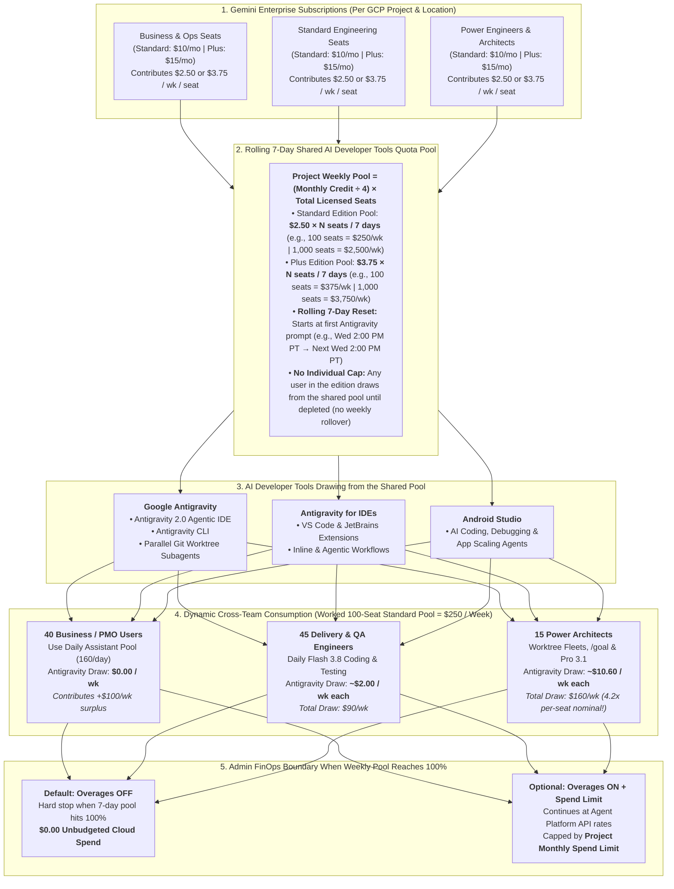

# Google Antigravity + Gemini Enterprise: Enterprise Value Proposition & Domain Playbooks

## 1. Executive Summary for Engineering Leaders, FinOps & Security Architects

Organizations scaling AI-native workflows across both technical and business functions require three foundational capabilities that **Google Antigravity + Gemini Enterprise** deliver natively:
1. **Shared Project-Level Weekly Quota Pooling**: **Gemini Enterprise Standard ($30/mo) and Plus** automatically fund a **project-wide weekly pooled Antigravity quota** (`$2.50/seat/week` on Standard or `$3.75/seat/week` on Plus), allowing lighter business and operations users to naturally balance high-intensity engineering workloads with zero unbudgeted overages by default.
2. **Defense-in-Depth Enterprise Governance**: Native Google Cloud IAM (`roles/businessaicode.*`), OS-level terminal sandboxing, Browser URL allow/denylists, Admin-overridden MCP registries, and deterministic local lifecycle hooks ([`_agents/hooks.json`](../_agents/hooks.json)).
3. **Full-Workforce Agent Creation**: Unifies no-code Markdown agents, low-code JSON/YAML plugins, IDE/CLI subagents, the Python Antigravity SDK (`google-antigravity`), and 24x7 background sidecar daemons under a single platform.

---

## 2. Core Enterprise Architectural Pillars & Differentiators

| Enterprise Dimension | **Google Antigravity + Gemini Enterprise Capability** | **Business & Engineering Impact** |
| :--- | :--- | :--- |
| **Licensing & Quota Pool Economics** | **Included in Gemini Enterprise** ($10/mo Standard or $15/mo Plus pooled across the GCP project weekly: **$2,500–$3,750/wk per 1,000 seats**). Zero overage by default (`Pay-as-you-go` toggleable with monthly spend caps). | Predictable FinOps budgeting with zero duplicate tool licensing costs and zero surprise per-token API spikes. |
| **Centralized Admin & IAM Governance** | Native **Google Cloud IAM** (`roles/businessaicode.admin`, `developer`, `viewer`), OS terminal sandbox toggle, Browser URL allow/denylists, and **Admin-overridden MCP JSON**. | Enforces zero-trust boundaries across every workstation from a single Google Cloud Console control plane. |
| **Multi-Agent & Worktree Architecture** | **Antigravity 2.0 Native Subagents** (`research`, `self`, `browser`, custom `.agents/agents/*.md`), **`New Worktree Mode`** for parallel conflict-free edits, and **`Idle` state warm-context reuse**. | Keeps parent context windows lean, prevents concurrent file collisions, and eliminates cold-start re-indexing tokens. |
| **Deterministic Compliance Gates (`hooks.json`)** | Native `PreToolUse`, `PostToolUse`, `PreInvocation`, `PostInvocation`, and `Stop` hooks ([`gate.py`](../hooks-scripts/gate.py)) that can **overwrite** arguments, **force_ask**, or **deny** dangerous commands in code. | Guarantees critical security and FinOps rules execute deterministically outside the LLM. |
| **Business-to-Architect Workforce Span** | Covers **100% of the workforce**: Markdown Citizen Agents, Low-Code Plugins, IDE/CLI Subagents, Python AGY SDK (`google-antigravity`), and 24x7 Sidecars. | Enables PMO, operations, finance, QA, and principal engineers to collaborate using shared skills and repositories. |
| **Model Fleet & Local NPU Zero-Egress Option** | **Gemini 3.8/3.7 Flash**, **Gemini 3.1 Pro**, **Nano Banana Pro/2** (UI mockups), **Gemini Omni 1.1 Flash** (video), **Deep Research**, plus **local Gemma 4 (`LiteRTAgentConfig`)** for privacy-sensitive workflows. | Matches every task to the optimal reasoning effort tier or runs 100% on-device at $0.00 cloud quota cost. |
| **Real-Time Telemetry & Chargeback** | **Developer Tool Metrics** in GCP Console refreshed every **5–15 minutes** (active users, requests, tokens, latency, errors) with Cloud Logging export. | Provides live adoption visibility and departmental FinOps attribution. |

### 2.1 Visual Architecture: How Gemini Enterprise Pooled Quota Works in Google Antigravity

Grounded in the official [Gemini Enterprise Quotas and Overages](https://docs.cloud.google.com/gemini/enterprise/docs/quotas-and-overages), [AI Developer Tools Overview](https://docs.cloud.google.com/gemini/enterprise/docs/ai-developer-tools-overview), and [View Pooled Quota Usage](https://docs.cloud.google.com/gemini/enterprise/docs/feature-usage) documentation, **Gemini Enterprise** eliminates rigid per-seat developer caps by pooling AI developer tool credits across all licensed users of the same edition within a Google Cloud project and location (`Global`, `US`, or `EU`).

#### Where Pooled Quota Applies Across Gemini Enterprise (Official Specification)

Per [Google Cloud Quotas and Overages](https://docs.cloud.google.com/gemini/enterprise/docs/quotas-and-overages#feature-quotas), quota pooling operates at two scopes inside a Google Cloud project and location (`Global`, `US`, `EU`):

| Quota Category | Included Tools & Capabilities | Gemini Enterprise Standard | Gemini Enterprise Plus | Pooling Boundary | Reset Schedule |
| :--- | :--- | :--- | :--- | :--- | :--- |
| **AI Developer Tools** *(Invoiced Cloud Billing required)* | • **Google Antigravity** (`Antigravity 2.0` & `Antigravity CLI`) • **Antigravity for IDEs** • **Android Studio** | **$10 credit / user / mo** *(Enforced as **$2.50 × seats** per 7-day pool)* | **$15 credit / user / mo** *(Enforced as **$3.75 × seats** per 7-day pool)* | **Pooled across all users in the same edition** per project & location | **Every 7 days** starting from the timestamp of the first AI developer tool prompt in the project (e.g., Wed 2:00 PM PT → next Wed 2:00 PM PT). No weekly rollover. |
| **Assistant & Conversational Search** | Enterprise Web Grounding & Workspace / Data Store Assistant | **160 queries / user / day** | **200 queries / user / day** | **Pooled across all users in the same edition** per project & location | **Daily** at midnight Pacific Time (PT) |
| **No-Code Agent Building Tools** | Creating & running no-code Workflow Builder agents | **1 agent created / user / day** | **10 agents created / user / day** | **Pooled across all users in the same edition** per project & location | **Daily** at midnight Pacific Time (PT) |
| **Deep Research** | Autonomous multi-step synthesis agent | **3 requests / user / day** | **10 requests / user / day** | **Pooled across all users in the same edition** per project & location | **Daily** at midnight Pacific Time (PT) |
| **Multimodal Generation** | Image & Video generation | **5 images & 2 videos / user / day** | **10 images & 3 videos / user / day** | **Pooled across all users in the same edition** per project & location | **Daily** at midnight Pacific Time (PT) |
| **Storage + Data Indexing** | Enterprise connector & RAG index storage | **30 GiB / user** | **75 GiB / user** | **Pooled across ALL editions combined** per project & location | Continuous allocation (prorated overage at $5/GiB/mo if exceeded) |

#### Why Project-Level Pooling Is a Decisive Advantage Over Siloed Per-Seat Quotas

| Architectural Scenario | Traditional Siloed Per-Seat Quota Model | **Google Antigravity + Gemini Enterprise Pooled Quota** |
| :--- | :--- | :--- |
| **Light or Non-Coding Seat Under-Utilization** | Unused monthly tokens on light users or PM/operations seats are **stranded and wasted** at month-end; cannot be transferred to busy engineers. | Every licensed seat in the edition automatically increases the project's shared weekly pool (`+$2.50/wk` Standard or `+$3.75/wk` Plus). Light users' unused developer credits are **100% available to active developers**. |
| **Power-User Sprint Bottlenecks** | A senior engineer running multi-file refactors hits an individual seat rate limit mid-sprint and is blocked or forced onto expensive per-user add-ons. | **Individual usage is never capped at the per-user nominal amount.** Power engineers can consume `4x–10x` the average per-seat credit from the shared edition pool without interruption. |
| **Reserving Non-Developer Credits for Engineering** | Requires purchasing separate developer-only point-tool licenses on top of enterprise AI seats. | Per [AI Developer Tools IAM Controls](https://docs.cloud.google.com/gemini/enterprise/docs/ai-developer-tools-overview#before-you-begin), admins can assign a custom role without AI developer tool permissions to business users in the same project—keeping **100% of their seats' Antigravity credits reserved for software engineers**. |
| **Zero-Ticket Elasticity & Spend Governance** | Adding seats or raising limits requires manual vendor contract amendments or per-user billing changes. | Quotas **scale automatically** with license count (including free-trial seats). Admins monitor real-time percentage consumption in **Gemini Enterprise > Usage & Spending** and keep `Overages` **OFF** by default (or **ON** with a strict monthly cap). |

---

## 3. Domain Adoption Playbooks

### 3.1 Antigravity + Gemini Enterprise in Application Development Teams
- **Core Engineering Needs**: Fast multi-file feature implementation, automated UI/E2E verification, and consistent code review standards across microservices and frontend applications.
- **How Antigravity + Gemini Enterprise Accelerates Delivery**:
  1. **Zero Incremental License Overhead**: Teams already provisioned with **Gemini Enterprise** immediately tap into the shared weekly project quota pool without separate per-seat IDE add-on fees.
  2. **Parallel Git Worktree Subagents (`/teamwork-preview`)**: Rather than waiting on a single sequential thread, engineers spawn parallel subagents in `New Worktree Mode`—one implementing backend logic (`gemini-3.8-flash`), one executing live Chromium E2E checks via `/browser`, and one auditing security via [`security-and-finops-auditor.md`](../starter-kits/tier3-pro-code-and-sdk/.agents/agents/security-and-finops-auditor.md).
  3. **Modular Context & Deterministic Guardrails**: Hierarchical [`AGENTS.md`](../AGENTS.md) and [`GEMINI.md`](../GEMINI.md) files pair with 4-trigger `_agents/rules/*.md` (`glob`, `model_decision`, `manual`, `always_on`) and `_agents/hooks.json` so standards are enforced automatically as files are edited.

### 3.2 Antigravity + Gemini Enterprise in DevOps, SRE & Legacy Modernization Teams
- **Core Engineering Needs**: Large-scale dependency upgrades, Terraform infrastructure authoring, autonomous test-fix loops, and 24x7 incident response.
- **How Antigravity + Gemini Enterprise Accelerates Delivery**:
  1. **Cost-Predictable Autonomous Loops (`/goal`)**: Engineers run `/goal` with `gemini-3.8-flash` (`Medium` thinking) inside the **pooled Gemini Enterprise allowance** to iterate until test suites and linters pass, escalating to `gemini-3.1-pro-preview` (`/boost`) only for complex architectural bottlenecks.
  2. **`Idle` Subagent Warm-Context Reuse**: Antigravity 2.0 subagents remain in the `Idle` state after completing an initial codebase or infrastructure scan, allowing follow-up verification prompts to reuse their warm context window without re-scanning the repository.
  3. **24x7 Autonomous Sidecar Daemons (`sidecar.json`)**: Platform and SRE teams deploy persistent background sidecars (`restart_policy: "always"`, see [`sentinel_sidecar.py`](../starter-kits/tier4-architect-fleet-and-sidecar/sidecars/incident-sla-sentinel/sentinel_sidecar.py)) that monitor P1/P2 incident queues and trigger root-cause analysis conversations automatically via `agentapi`.

### 3.3 Antigravity + Gemini Enterprise in Regulated & Privacy-Sensitive Enterprise Environments
- **Core Engineering Needs**: Strict data residency, VPC Service Controls (VPC-SC) perimeter compliance, audit logging, and local PII scrubbing before cloud processing.
- **How Antigravity + Gemini Enterprise Accelerates Delivery**:
  1. **Google Cloud Project Perimeter & On-Device Gemma 4**: All cloud interactions authenticate through the organization's governed **Google Cloud project boundary** (`vertex=True` ADC binding), while sensitive log scrubbing or offline tasks run 100% locally on workstation NPUs/GPUs via **Gemma 4 (`LiteRTAgentConfig`)**.
  2. **Interactive Socratic Alignment (`/grill-me` + `/plan`)**: Before modifying regulated payment, healthcare, or core ledger code, engineers run `/grill-me` and `/plan` to produce an auditable `implementation_plan.md` artifact requiring explicit human sign-off.
  3. **Immutable Compliance Audit Trail**: Administrators can enable prompt/response logging to Cloud Logging and enforce local `PreToolUse` / `PostToolUse` audit hooks across all repositories.

---

## 4. Enterprise Architecture & Adoption FAQ

| Common Question | Grounded Technical & Operational Guidance |
| :--- | :--- |
| *"How do we achieve maximum reasoning depth on complex multi-file refactoring?"* | Switch `/model` to **`gemini-3.1-pro-preview`** (or `antigravity-preview-05-2026`) with **`High` thinking effort** or invoke **`/boost`**. Pair it with `/plan` and parallel `New Worktree Mode` subagents ([`code-reviewer.md`](../starter-kits/tier3-pro-code-and-sdk/.agents/agents/code-reviewer.md)) for test-verified execution. |
| *"How do we standardize instructions across monorepos and subdirectories?"* | Antigravity automatically walks the directory tree from the Git root down to the active working directory to load **`AGENTS.md`** and **`GEMINI.md`** (up to `100 KB`), complemented by file-pattern (`glob`) and task-driven (`model_decision`) rules in `_agents/rules/*.md`. |
| *"How do we prevent accidental destructive commands when engineers use Turbo Mode?"* | Configure **deterministic `_agents/hooks.json` (`PreToolUse`)**. Our [`hooks-scripts/gate.py`](../hooks-scripts/gate.py) intercepts every command in Python and returns `"decision": "deny"` on `terraform destroy`, `rm -rf`, or credential file edits before the shell ever executes them. |
| *"How do we ensure power users don't exhaust shared project quota mid-week?"* | Gemini Enterprise pools quota across all project seats (**$2.50/seat/week Standard** or **$3.75/seat/week Plus**). Routing 80% of subagent exploration to `gemini-3.8-flash` (`Low`/`Medium` effort) and tracking **Developer Tool Metrics** (5–15 min refresh) provides ample headroom while keeping unbudgeted overages at $0.00. |
